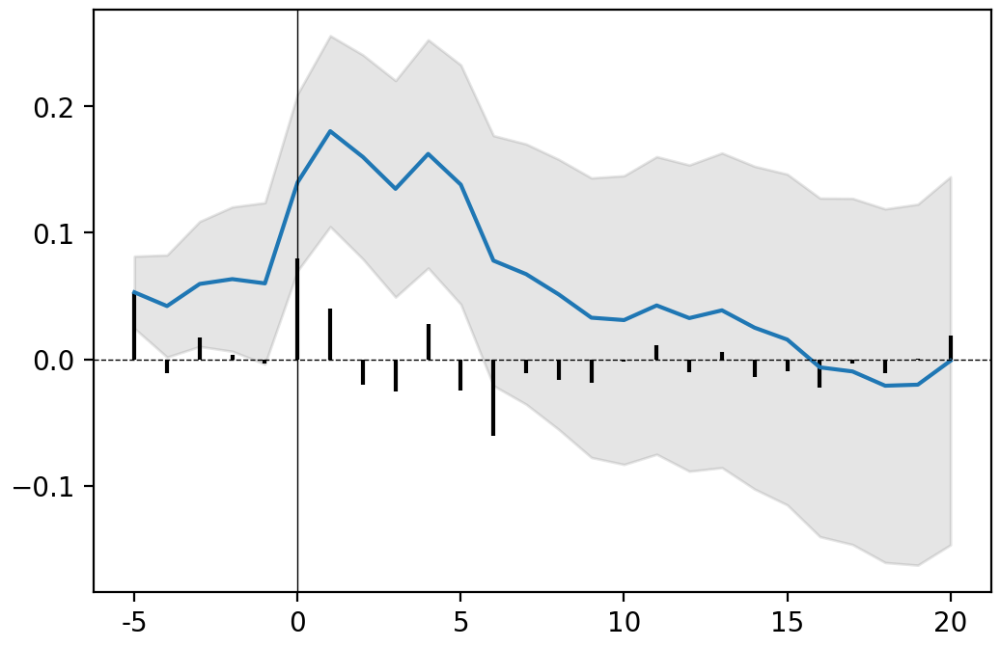

# Get Started

Through two examples, we will discover how to perform 
an event study analysis on a single event or on an aggregate of events.

```eval_rst
.. contents::
    :local:
    :depth: 1

.. note::
    You can use the `interactive version <https://mybinder.org/v2/gh/LemaireJean-Baptiste/eventstudy/master?filepath=example%2FEventstudy%20Example.ipynb>`_ of this tutorial to play with the functions yourself.
```

## Preliminary work

1. Load the `eventstudy` module and its dependencies: `numpy` and `matplotlib`:
    ```Python
    import eventstudy as es
    import numpy as np
    import matplotlib.pyplot as plt
    ```

2. Set the parameters needed for your events: 
    the returns and Fama-French factors (using `es.Single.import_returns()`and `es.Single.import_FamaFrench()`):
    ```Python
    es.Single.import_returns('returns.csv')
    es.Single.import_FamaFrench('famafrench.csv')
    ```

## Example 1: A single event
As an introductory example, we will compute the event study 
analysis of the announcement of the first iphone,
made by Steve Jobs during MacWorld exhibition, on January 7, 2007.

1. Run the event study, here using the Fama-French 3-factor model:
    ```Python
    event = es.Single.FamaFrench_3factor(
        security_ticker = 'AAPL',
        event_date = np.datetime64('2013-03-04'),
        event_window = (-2,+10), 
        estimation_size = 300,
        buffer_size = 30
    )
    ```

```eval_rst
.. note::
    You can easily play with the parameters and adjust the event study analysis to your needs.

    For more details, see the documentation on `FamaFrench_3factor function <api/eventstudy.Single.FamaFrench_3factor>`_.

    See also `other models' function <api/eventstudy.Models>`_.
    You can even `set your own modelisation functions <extend.html>`_
```

2. Display results:
    - In a plot:
    ```Python
    event.plot(AR=True)
    plt.show() # use standard matplotlib function to display the plot
    ```

    

    *grey area: confidence interval (here at 90%); blue line: CAAR; black bars: AR*

    ```eval_rst
    .. note::
        You can remove the confidence interval (set `CI = False`) or
        change its level of confidence (set `confidence = .95` for a confidence interval at 95%).

        By default AR are note displayed (set `AR = True` to add them to the plot).

        For more details, see the documentation on `plot function <api/eventstudy.Single.plot>`_ .
    ```
    - Or in a table:
    ```Python
    event.results(decimals=[3,5,3,5,2,2])
    ```

|    |     AR |   Variance AR | CAR        |   Variance CAR |   T-stat |   P-value |
|---:|-------:|--------------:|:-----------|---------------:|---------:|----------:|
| -5 | -0.053 |       0.00048 | -0.053 **  |        0.00048 |    -2.42 |      0.01 |
| -4 |  0.012 |       0.00048 | -0.041 *   |        0.00096 |    -1.33 |      0.09 |
| -3 | -0.013 |       0.00048 | -0.055 *   |        0.00144 |    -1.43 |      0.08 |
| -2 |  0.004 |       0.00048 | -0.051     |        0.00192 |    -1.15 |      0.13 |
| -1 |  0     |       0.00048 | -0.051     |        0.00241 |    -1.03 |      0.15 |
|  0 | -0.077 |       0.00048 | -0.128 **  |        0.00289 |    -2.37 |      0.01 |
|  1 | -0.039 |       0.00048 | -0.167 *** |        0.00337 |    -2.88 |      0    |
|  2 |  0.027 |       0.00048 | -0.14 **   |        0.00385 |    -2.26 |      0.01 |
|  3 |  0.024 |       0.00048 | -0.116 **  |        0.00433 |    -1.77 |      0.04 |
|  4 | -0.024 |       0.00048 | -0.14 **   |        0.00481 |    -2.02 |      0.02 |
|  5 |  0.023 |       0.00048 | -0.117 *   |        0.00529 |    -1.61 |      0.05 |
|  6 |  0.057 |       0.00048 | -0.06      |        0.00577 |    -0.79 |      0.21 |
|  7 |  0.011 |       0.00048 | -0.049     |        0.00626 |    -0.62 |      0.27 |
|  8 |  0.011 |       0.00048 | -0.038     |        0.00674 |    -0.46 |      0.32 |
|  9 |  0.017 |       0.00048 | -0.021     |        0.00722 |    -0.24 |      0.4  |
| 10 |  0.003 |       0.00048 | -0.018     |        0.0077  |    -0.2  |      0.42 |
| 11 | -0.01  |       0.00048 | -0.028     |        0.00818 |    -0.31 |      0.38 |
| 12 |  0.008 |       0.00048 | -0.02      |        0.00866 |    -0.21 |      0.42 |
| 13 | -0.009 |       0.00048 | -0.028     |        0.00914 |    -0.3  |      0.38 |
| 14 |  0.012 |       0.00048 | -0.016     |        0.00962 |    -0.16 |      0.43 |
| 15 |  0.011 |       0.00048 | -0.005     |        0.01011 |    -0.05 |      0.48 |
| 16 |  0.024 |       0.00048 | 0.018      |        0.01059 |     0.18 |      0.43 |
| 17 |  0.001 |       0.00048 | 0.019      |        0.01107 |     0.18 |      0.43 |
| 18 |  0.009 |       0.00048 | 0.028      |        0.01155 |     0.26 |      0.4  |
| 19 | -0.002 |       0.00048 | 0.026      |        0.01203 |     0.24 |      0.41 |
| 20 | -0.02  |       0.00048 | 0.006      |        0.01251 |     0.06 |      0.48 |

```eval_rst
.. note::
    Asterisks are added automatically to highlight the level of significance
    (Significance level: \*\*\* at 99%, \*\* at 95%, \* at 90%). 
    You can remove asterisks by setting `asterisks` parameter at `False`.

    `decimals` is a list of integer setting for each column (except index) the rounding decimal. 
    You can also set one integer (e.g. `decimals = 3`) if you want all columns to be rounded the same.

    See the documentation on this `results function <api/eventstudy.Single.results>`_ for more details.
```

## Example 2: An aggregate of events

To be continued...
